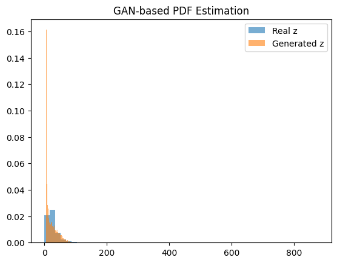

# Assignment 2: GAN-based PDF Estimation

## Objective

The objective of this assignment is to learn the probability distribution of transformed NO₂ concentration data using a Generative Adversarial Network (GAN). In this assignment, no mathematical form of the probability density function is assumed. The distribution is learned directly from data samples.

---

## Dataset and Preprocessing

The India Air Quality dataset was used for this assignment. From the dataset, only the NO₂ concentration column was selected and treated as the input variable $x$.  
Before starting with the analysis, rows that had missing (NA) values in the NO₂ column were removed.

---

## Transformation Parameters

The NO₂ concentration values were transformed using the following equation:

$$
z = x + a_r \sin(b_r x)
$$

The parameters were calculated using the roll number as mentioned in the assignment:

$$
a_r = 0.5 \, (r \bmod 7)
$$

$$
b_r = 0.3 \, (r \bmod 5 + 1)
$$

This transformation is responsible for bringing small non linear changes while still keeping the values as close as possible to the original values.

---

## GAN Architecture

A simple GAN architecture was used to learn the distribution of the transformed variable $z$.

- **Generator**:  
  The generator takes random noise sampled from a normal distribution as input and produces a single output value of $z$. It consists of fully connected layers with a non-linear activation function.

- **Discriminator**:  
  The discriminator takes a value of $z$ as input and decides whether the sample is real or generated. It uses fully connected layers, with a sigmoid function applied at the output to produce a probability.

Binary cross-entropy loss was used for training, and both the generator and discriminator were trained using the Adam optimizer.

---

## PDF Estimation using GAN

After training the GAN, the generator was used to produce a large number of synthetic samples. Since the GAN does not provide an explicit probability density function, the PDF was estimated using a histogram-based density estimation method.

The histogram of the generated samples represents the learned distribution and was compared with the histogram of the real transformed data.

---

## GAN-based PDF Plot

---

## Observations

### Mode Coverage

The GAN-generated samples capture the main high-density region of the real data. The primary peak near lower values of $z$ is well represented, although the tail of the distribution is less prominent.

### Training Stability

The training process was stable. Both generator and discriminator losses showed small oscillations but did not diverge or collapse during training.

### Quality of Generated Distribution

The generated samples follow the overall trend of the real data distribution. While there are small differences in the spread, the GAN successfully learned the main structure of the data.

---

## Conclusion

In this assignment, a GAN was used to learn the probability distribution of transformed NO₂ concentration data without assuming any parametric form.The results show that GANs can be used to model data distributions using only samples from the data.